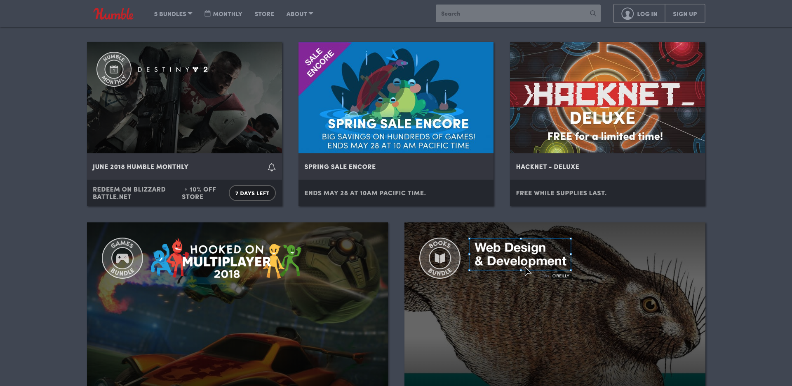

# Humble Bundle Clone

## By Bobby Martin

# Description
This is a UI solo project that represents the past weeks work.

# Examples
| My Examples | Humble Bundles Site |
|-------------|:-------------------:|
|             | |

# Setup Requirements
* Clone this repository
* Run npm install to install all dependencies
* Run npm run start to build and start the development environment

# Technologies
* HTML
* CSS
* JavaScript
* Webpack
* Jasmine
* Karma

This project uses the _MIT License_
&copy; **Bobby Martin** 2018
